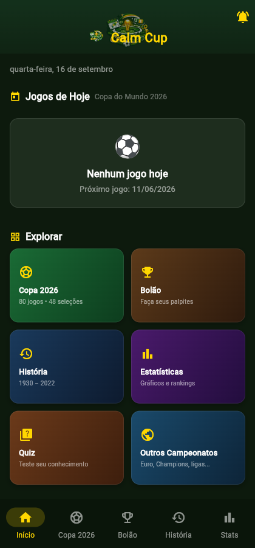
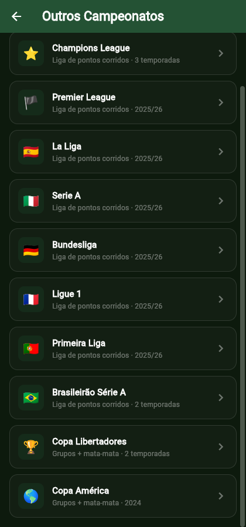
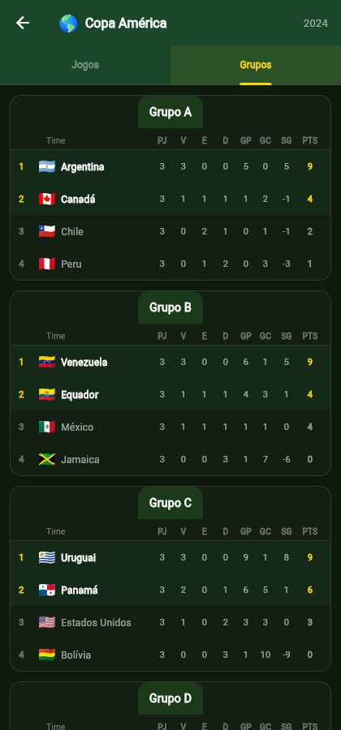
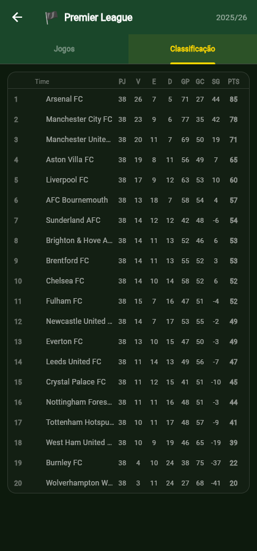

<p align="center">
  
</p>

# 🏆 Calm Cup

Um app Flutter multi-campeonato de futebol — Copa do Mundo, Eurocopa, Brasileirão, Champions League, Libertadores, Copa América e as 6 principais ligas europeias — construído sobre uma arquitetura plugável que combina duas fontes de dados públicas e gratuitas diferentes (JSON e um parser de texto escrito do zero).

A Flutter multi-competition football app — World Cup, Euro, Brazilian League, Champions League, Copa Libertadores, Copa América and the 6 major European leagues — built on a pluggable architecture combining two different free public data sources (JSON and a from-scratch text parser).

**🇧🇷 [Português](#-sobre-pt) · 🇺🇸 [English](#-about-en)**

<p align="center">
  
  
  
  
</p>

---

## 🇧🇷 Sobre {#sobre-pt}

O Calm Cup começou como um app de acompanhamento só da Copa do Mundo 2026. Este repositório documenta a evolução dele para um app multi-campeonato de verdade — não trocando a UI, mas refatorando a arquitetura de dados por baixo pra suportar formatos de competição completamente diferentes (liga de pontos corridos, grupos + mata-mata, fase de liga híbrida como a nova Champions League) sem duplicar lógica.

### Funcionalidades

- **7 campeonatos, 11+ temporadas**: Copa do Mundo 2026 (+ histórico 1930–2022), Eurocopa, Champions League, Brasileirão Série A, Copa Libertadores, Copa América e Premier League/La Liga/Serie A/Bundesliga/Ligue 1/Primeira Liga.
- **Chaveamento real** da Copa do Mundo 2026, resolvendo códigos de classificação (`1A`, `W73`, `3A/B/C/D`) contra a tabela e os placares reais — sem simulação.
- **Simulador** de torneio com auto-simulação e chaveamento interativo.
- **Bolão** (pool de palpites) com pontuação automática.
- **Histórico** completo de Copas (1930–2022): artilheiros, títulos por país, maiores goleadas.
- **Notificações locais** de início/fim de jogo, agendadas mesmo com o app fechado (WorkManager), com fallback automático para alarme inexato no Android 14+, onde `SCHEDULE_EXACT_ALARM` deixou de ser concedida a apps fora da categoria despertador/calendário.
- **Quiz** de conhecimentos gerais sobre Copa do Mundo.
- Tudo funcionando **offline** com cache local: *todas* as competições guardam o último dado baixado (indexado pela URL da edição), e a UI distingue "sem jogos hoje" de "sem conexão" em vez de tratar os dois como lista vazia.

### Arquitetura

O ponto central deste projeto, do ponto de vista de engenharia, foi generalizar um app construído em torno de uma única competição sem reescrever a UI do zero.

**O problema**: cada campeonato novo trazia um formato de dado diferente.
- Copa do Mundo e Eurocopa: JSON, grupos + mata-mata, com códigos de classificação a resolver (`1A`, `W73`).
- Ligas domésticas: JSON, mas liga de pontos corridos pura — sem grupo, sem mata-mata.
- Champions League: mistura as duas coisas — uma fase de liga (tabela única) seguida de mata-mata.
- Brasileirão, Libertadores e Copa América: **sem JSON nenhum** — só um formato de texto legado (duas gramáticas diferentes), exigindo escrever um parser do zero.

**A solução**: um modelo `Competition`/`CompetitionEdition` onde cada *edição* (temporada) carrega sua própria fonte de dados (`DataSourceFormat.json` ou `.text` + o dialeto de texto quando aplicável) — a mesma competição pode ter temporadas em formatos diferentes (a Champions League tem JSON só em 2019-20 e 2024-25; todo o resto só em texto). Um `CompetitionProvider` genérico consome qualquer uma delas através da mesma interface, e a tela de competição decide sozinha se mostra uma tabela de grupo, uma tabela única ou uma lista cronológica de jogos, dependendo do formato — sem `if` espalhado pela UI.

```
Competition + CompetitionEdition (formato + URL)
        │
        ▼
CompetitionProvider ──► OpenFootballJsonService   (schema JSON, 7 competições)
        │          └──► OpenFootballTextService   (2 dialetos de texto, 4 competições)
        ▼
computeStandings() / bracket_code_resolver.dart   (lógica compartilhada, extraída
                                                     de duplicação real entre providers)
        ▼
CompetitionScreen (Jogos + Classificação/Grupos, adaptado ao formato)
```

Duas duplicações de lógica real (não hipotéticas) foram extraídas durante o processo: a resolução de código de chaveamento (`1A`/`W73`/`3A/B/C/D`) estava repetida palavra-por-palavra entre dois providers, e o mesmo aconteceu com o cálculo de classificação (pontos/vitórias/saldo de gols). As duas viraram módulos isolados e testados, reduzindo código em vez de só reaproveitar.

O parser de texto (`OpenFootballTextService`) foi escrito contra dados **reais**, não documentação — as duas gramáticas de súmula do openfootball têm inconsistências genuínas (placar às vezes vem como array simples em vez de objeto, nomes de time com espaçamento irregular) que só apareceram testando contra o dataset completo. Ver a seção de testes abaixo.

### Segurança

- Build de release com **R8/ProGuard habilitado** (minify + shrink), com regras específicas para os plugins que usam reflexão (`flutter_local_notifications`, `workmanager`).
- `network_security_config.xml` negando tráfego cleartext explicitamente.
- Build de release não quebra em checkout limpo sem `key.properties` (cai pra assinatura de debug em vez de lançar exceção).
- Sem chaves de API em lugar nenhum — todas as fontes de dados são públicas e gratuitas.
- Regras do Firestore versionadas no repositório (`firestore.rules`, deploy com `firebase deploy --only firestore:rules`): cada participante do ranking só escreve na própria entrada, e a pontuação é validada contra o teto de 3 pontos por palpite. O cálculo em si continua no cliente — o ranking é "na honra", e as regras servem pra impedir o valor absurdo, não pra provar o placar.

### Gerando um release

```
VER-APP.bat     roda o app em debug (funciona de qualquer pasta)
GERAR-AAB.bat   gera o AAB assinado para a Play Store
```

**O AAB precisa ser gerado de um caminho sem acento.** O compilador AOT do
Android (`gen_snapshot`) não consegue abrir arquivos cujo caminho tenha
caractere não-ASCII: o `Á` de "Área de Trabalho" chega corrompido e o build
morre com `Unable to read file: ...app.dill` / `exited with code 255`. O
sintoma engana porque `flutter test`, `analyze`, `build web` e o modo debug
funcionam normalmente — só o AOT quebra. `GERAR-AAB.bat` detecta isso e para
antes de tentar, em vez de deixar o erro confuso aparecer.

Para criar (ou recriar) o clone de release:

```bash
git clone -b <branch> "<caminho do repo>" C:/projetos/calmcup-release
cp <repo>/android/key.properties      C:/projetos/calmcup-release/android/
cp <repo>/android/calmcup-release.jks C:/projetos/calmcup-release/android/
```

Os dois arquivos de assinatura são copiados à mão porque estão no
`.gitignore` — e é assim que deve ser.

### Stack técnica

Flutter · Dart · Provider (state management) · `fl_chart` · `flutter_local_notifications` · `workmanager` · `shared_preferences` · testes com `flutter_test`.

### Testes e verificação

Além dos testes unitários (parsing, cálculo de classificação, resolução de chaveamento — todos com fixtures de dados **reais**, não inventados), cada fase deste projeto foi verificada rodando o app de verdade (`flutter run -d web-server` + Playwright para screenshot) contra as fontes de dados reais, não só `flutter analyze`/`flutter test`. Isso importa: pelo menos 6 bugs reais (um deles derrubando o app inteiro na Web, outro fazendo zero partidas serem reconhecidas num formato inteiro) só apareceram rodando contra o dataset completo — nenhum aparecia em `flutter analyze` nem nos testes escritos antes da verificação visual.

### Fontes de dados

Todos os dados vêm dos repositórios públicos e gratuitos do [openfootball](https://github.com/openfootball) no GitHub — sem chave de API, sem custo. Créditos ao mantenedor original pelos dados coletados e organizados.

### Limitações conhecidas

- Libertadores e a maioria das temporadas da Champions League não têm o grupo de cada partida na fonte de dados — a aba "Grupos" mostra uma lista cronológica em vez de tabela de classificação nesses casos (decisão deliberada, não bug).
- Placar agregado de mata-mata em duas pernas (ida e volta) não é somado automaticamente — cada jogo aparece com seu próprio placar.
- O Quiz ainda é só sobre Copa do Mundo — expandir pra outras competições é trabalho de conteúdo pendente, não uma limitação técnica.

### Como rodar

```powershell
git clone https://github.com/lucas-s-santos/Calm-Cup.git
cd Calm-Cup
flutter pub get
flutter run
```

Build de release (Android):

```powershell
flutter build apk --release
```

Rodar os testes:

```powershell
flutter test
```

---

## 🇺🇸 About {#about-en}

Calm Cup started as a World Cup 2026 companion app. This repository documents its evolution into a genuinely multi-competition app — not by rewriting the UI, but by refactoring the underlying data architecture to support completely different competition formats (round-robin league, groups + knockout, hybrid league-phase-then-knockout like the new Champions League) without duplicating logic.

### Features

- **7 competitions, 11+ seasons**: World Cup 2026 (+ 1930–2022 history), Euro, Champions League, Brazilian Série A, Copa Libertadores, Copa América, and Premier League/La Liga/Serie A/Bundesliga/Ligue 1/Primeira Liga.
- **Real bracket resolution** for World Cup 2026, resolving placeholder codes (`1A`, `W73`, `3A/B/C/D`) against the actual standings and results — no simulation involved.
- **Tournament simulator** with auto-simulation and an interactive bracket.
- **Prediction pool** ("Bolão") with automatic scoring.
- **Full World Cup history** (1930–2022): top scorers, titles by country, biggest wins.
- **Local notifications** for kickoff/full-time, scheduled even with the app closed (WorkManager).
- **Trivia quiz** about World Cup history.
- Fully functional **offline** via local caching.

### Architecture

The core engineering story of this project was generalizing an app built around a single competition without rewriting the UI from scratch.

**The problem**: every new competition brought a different data shape.
- World Cup and Euro: JSON, groups + knockout, with placeholder codes to resolve (`1A`, `W73`).
- Domestic leagues: JSON too, but a pure round-robin league — no groups, no knockout.
- Champions League: a mix of both — a league phase (single table) followed by a knockout stage.
- Brazilian league, Libertadores, and Copa América: **no JSON at all** — only a legacy plaintext format (two different grammars), requiring a parser written from scratch.

**The solution**: a `Competition`/`CompetitionEdition` model where each *edition* (season) carries its own data source (`DataSourceFormat.json` or `.text`, plus the text dialect when applicable) — the same competition can span multiple formats across seasons (Champions League has JSON only for 2019-20 and 2024-25; every other season is text-only). A generic `CompetitionProvider` consumes either through the same interface, and the competition screen itself decides whether to render a group table, a single league table, or a flat chronological match list — no scattered `if`s across the UI.

```
Competition + CompetitionEdition (format + URL)
        │
        ▼
CompetitionProvider ──► OpenFootballJsonService   (JSON schema, 7 competitions)
        │          └──► OpenFootballTextService   (2 text dialects, 4 competitions)
        ▼
computeStandings() / bracket_code_resolver.dart   (shared logic, extracted from
                                                     real duplication across providers)
        ▼
CompetitionScreen (Fixtures + Table/Groups, adapted to the format)
```

Two instances of real (not hypothetical) duplicated logic were extracted along the way: bracket-code resolution (`1A`/`W73`/`3A/B/C/D`) was repeated verbatim across two providers, and the same happened with standings math (points/wins/goal difference). Both became isolated, tested modules — a net reduction in code, not just reuse for reuse's sake.

The text parser (`OpenFootballTextService`) was written against **real** data, not documentation — openfootball's two scoresheet grammars have genuine inconsistencies (scores sometimes shown as a bare array instead of an object, irregular team-name spacing) that only surfaced when tested against the full dataset. See the testing section below.

### Security

- Release builds with **R8/ProGuard enabled** (minify + shrink), with specific keep rules for reflection-based plugins (`flutter_local_notifications`, `workmanager`).
- Explicit `network_security_config.xml` denying cleartext traffic.
- Release build no longer crashes on a clean checkout without `key.properties` (falls back to debug signing instead of throwing).
- No API keys anywhere — every data source is free and public.

### Tech stack

Flutter · Dart · Provider (state management) · `fl_chart` · `flutter_local_notifications` · `workmanager` · `shared_preferences` · tests with `flutter_test`.

### Testing and verification

Beyond unit tests (parsing, standings math, bracket resolution — all backed by **real** data fixtures, not invented ones), every phase of this project was verified by actually running the app (`flutter run -d web-server` + Playwright for screenshots) against the real data sources, not just `flutter analyze`/`flutter test`. This mattered: at least 6 real bugs (one crashing the entire app on Web, another causing zero matches to be recognized across an entire data format) only surfaced when running against the full dataset — none of them showed up in static analysis or in tests written before visual verification.

### Data sources

All data comes from [openfootball](https://github.com/openfootball)'s free, public GitHub repositories — no API key, no cost. Credit to the original maintainer for collecting and organizing the data.

### Known limitations

- Libertadores and most Champions League seasons don't include per-match group info in the source data — the "Groups" tab shows a flat chronological list instead of a standings table for those (a deliberate decision, not a bug).
- Two-legged knockout aggregate scores aren't automatically summed — each leg shows its own scoreline.
- The trivia quiz is still World Cup-only — expanding it to other competitions is pending content work, not a technical limitation.

### Running locally

```powershell
git clone https://github.com/lucas-s-santos/Calm-Cup.git
cd Calm-Cup
flutter pub get
flutter run
```

Release build (Android):

```powershell
flutter build apk --release
```

Running tests:

```powershell
flutter test
```

---

## Licença / License

© 2026 Lucas Silva dos Santos. Todos os direitos reservados — este código não está sob licença de código aberto. / All rights reserved — this code is not under an open-source license.

## Contato / Contact

Dúvidas ou sugestões: abra uma [issue no GitHub](https://github.com/lucas-s-santos/Calm-Cup/issues). / Questions or suggestions: open a [GitHub issue](https://github.com/lucas-s-santos/Calm-Cup/issues).
